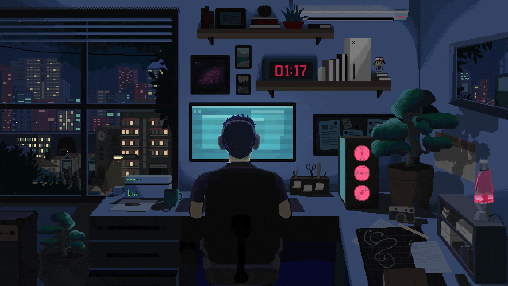

    

 

# Hey There , I'm Mohamad Hosein Mohseni

> ## ℹ️ About Me

👋 Hi, I'm Masen

💻 Front-End Developer | 🎓 Computer Engineering Student  
📍 Kerman Province, Iran

I build responsive, user-focused web interfaces that are both functional and visually refined.  
My goal is simple: turn ideas into clean, interactive, and scalable web experiences.

---

> ## 🚀 What I Do

- Build modern, responsive web applications using HTML, CSS, JavaScript, and React

- Develop scalable front-end architectures using React Router, Context API, Redux, TailwindCSS, ...

- Manage client-side state effectively (local & global state management)

- Focus on performance optimization and reusable component design

- Translate UI/UX concepts into interactive, maintainable interfaces

---

> ## 📌 Current Focus

- Deepening my knowledge of the React ecosystem

- Mastering advanced state management patterns

- Building production-ready React projects

- Improving code structure, scalability, and maintainability

- Learning best practices in frontend architecture

---

> ## 🌱 Philosophy

- Build components, not pages.
- Think in systems, not screens.
- Write code that scales.

---

> ## 📫 Let’s Connect

If you’re interested in collaboration, learning together, or discussing web development, feel free to explore my repositories or reach out.  
Click platforms below 👇

     &nbsp;&nbsp;&nbsp;
     &nbsp;&nbsp;&nbsp;
     &nbsp;&nbsp;&nbsp;

---

> ## 🛠️ Tech Stack

    

---

> ## 📊 Account Stats

    

---

<h3>
👋 Thanks for visiting my profile 😊♥️

⭐ Check out my pinned projects below 👇

</h3>

